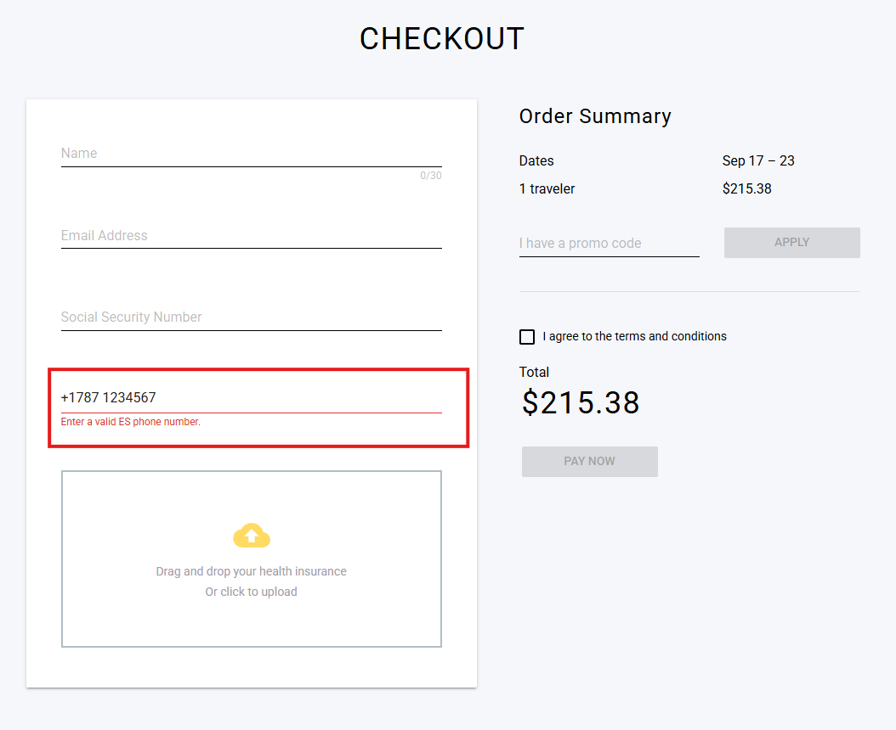

# Reporte de Bugs

## Bug 1: Validación incorrecta del campo "Phone Number"

**ID:** BUG-001  
**Título:** El campo *Phone Number* no acepta números válidos con el prefijo +1787 y 7 dígitos adicionales.  

### Descripción:
Según los criterios de la prueba, el campo *Phone Number* debe aceptar números en el formato **+1787xxxxxxx** (prefijo +1787 y 7 dígitos más).  
Sin embargo, al ingresar un número con este formato válido, la aplicación muestra un error de validación y no permite continuar con el proceso de checkout.  

### Pasos para reproducir:
1. Ir al flujo de **Checkout**.  
2. Ingresar los datos requeridos (Name, Email, SSN).  
3. En el campo *Phone Number*, ingresar el valor `+17871234567`.  
4. Observar el mensaje de error que aparece debajo del campo.  

### Resultado Actual:
El sistema muestra el mensaje:  
`Enter a valid ES phone number.`  
y bloquea la habilitación del botón **PAY NOW**.  

### Resultado Esperado:
El sistema debería aceptar el número en el formato **+1787xxxxxxx** como válido, sin mostrar error, y permitir continuar con el pago.  

### Evidencia:
  

### Severidad:
⚠️ **Alta** – Bloquea al usuario de completar el checkout aunque use el formato requerido.  

---
